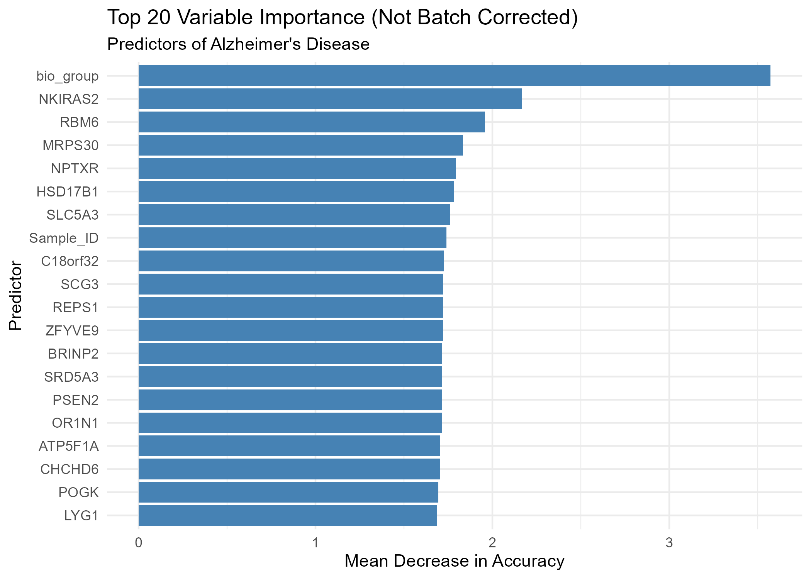

```{r setup, include=FALSE}
knitr::opts_chunk$set(echo = TRUE)
```

## Assessing Predictive Performance and Gene Selection Consistency in Gene Expression Models

<https://github.com/ylzzzzz/625-Final-Project>

Abstract/summary

Introduction

-   Introduction of Dataset

-   Introduction of question of interest

Methods

-   Introduction of Methods, Packages, and approach(es) taken

LASSO

Support Vector Machine

Random Forest In addition, we also built a handful of black box models to

In the comparative study of Alzheimer's Disease prediction using the GenoTEX dataset, the Random Forest model emerged as the superior classifier, achieving a test set accuracy of 83.11% and an AUC of 0.889. Utilizing a feature selection process that retained 1,472 gene features, the model identified key biological predictors such as NPTX2, NEDD, and KATNIP. Its performance was robust, with the Out-of-Bag (OOB) error rate stabilizing significantly after approximately 250 trees and maintaining the lowest Root Mean Squared Error (0.3386) among all tested models.

Conversely, the Neural Network, designed with two dense hidden layers and dropout regularization, struggled to generalize, achieving a significantly lower test accuracy of 65.66% despite a training accuracy of 80.13%. While the Neural Network was faster to train (5.22 seconds), it exhibited signs of overfitting and a higher RMSE of 0.4671 compared to the Random Forest. A critical finding from the study's UMAP analysis revealed that the data clustered primarily by cohort rather than disease status, indicating that the models—and particularly the Neural Network—may have been influenced by strong batch effects rather than purely biological signals.

Here is the variable importance plot generated by the model:



The model performance is visualized below using the ROC curve:


We also analyzed the error rate stabilization over 1000 trees:


Neural Network

Results

Conclusion

References

No more than 5 pages with everything included.

Contribution Statement

The contributions from each of the group member should be clearly stated (although all the students in a group will receive equal points for the final group project).
