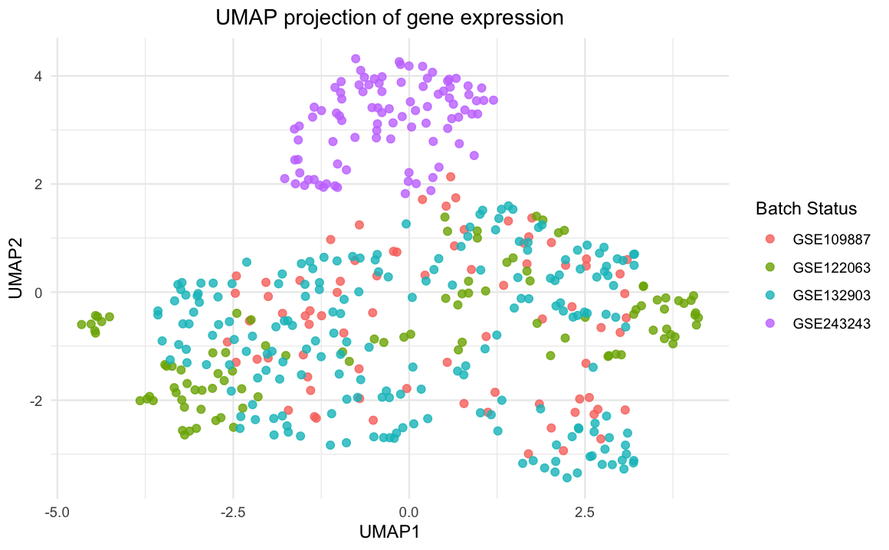
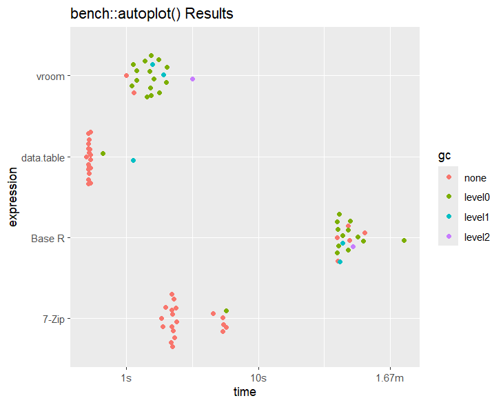

# Impact of Cross-Cohort Heterogeneity on Differential Gene Expression and Feature Selection in Alzheimer’s Disease

## Overview

Alzheimer’s disease is associated with widespread alterations in gene expression. While integrating data from multiple independent cohorts can improve statistical power, it is often challenged by cross-cohort heterogeneity arising from differences in brain regions, experimental platforms, and preprocessing pipelines.

In this study, we investigate the impact of this heterogeneity on differential gene expression analysis and exploratory feature selection. Using normalized bulk gene expression data from eight independent cohorts, we:

1.  Characterized cross-cohort heterogeneity using within-cohort differential expression analysis.

2.  Evaluated the impact of batch effects by conducting pooled analyses (with and without cohort adjustment).

3.  Assessed the robustness of gene–disease associations across cohorts.

Our results highlight the importance of accounting for cross-cohort heterogeneity when integrating multi-cohort gene expression data.

## Data Source

The data used in this project is sourced from the **GenoTEX: LLM Agent Benchmark for Genomic Analysis** dataset. \* **Source:** [Kaggle - GenoTEX Dataset](https://www.kaggle.com/datasets/haoyangliu14/genotex-llm-agent-benchmark-for-genomic-analysis) \* **Content:** Verified and curated datasets from the GEO database.

## Repository Structure

-   `data/`: Contains processed CSV files.
-   `batch_effect_analysis/`: Scripts and outputs regarding batch effect diagnostics and correction.
-   `models/`: Code for predictive models built on the cleaned data.
-   `figures/`: Visualizations generated during the analysis.
-   `benchmarking/`: Test for improving the import efficiency of the code
-   `preprocessing_code/`: Files for import and cleaning the datasets
-   `results/`: Text output from the trained models
-   `utils/`: Functions for optimizing workflow

## Getting Started

### 1. Data Preparation

To replicate the cleaning process, download the "Alzheimers" data folder from the Kaggle link above. Run the `Alzheimers_data_cleaning_full.R` script, which processes the raw data and outputs the final cleaned dataset. The final cleaned dataset we used for this project is `Alzheimers_Disease_cleandata_final.csv` in the `/data` folder.

### 2. Loading the Data

Once the data is processed, you can import the final dataset into R as follows:

``` r
library(data.table)
df = fread("./data/Alzheimers_Disease_final.csv")
```

## Batch Effect Analysis 

We analyzed the effect of cohort heterogeneity (batch effects) on the data using UMAP projections. The visualizations below demonstrate the data structure before and after batch correction.

Before Batch Correction: Significant clustering by batch is visible, indicating technical variation.


After Batch Correction: After adjustment, samples cluster more closely by biological condition (Disease Status) rather than batch.



## Models 

The models folder contains the code for the various machine learning models built to predict disease status based on the selected genomic features. While it was initially a significant part of our proposal, we determined that the data preprocessing and batch effect analysis were more significant to report.

## Benchmark

During our initial analysis, we identified that loading the full raw dataset every session was a bottleneck. We optimized the data ingestion process to significantly reduce load times, ensuring a smoother workflow for downstream analysis.



## Contribution
